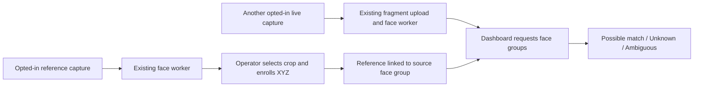

# Consent-based face recognition across captures

Status: proposed implementation handoff; no feature code is included. Written September 25, 2026 against `master` commit `bb4a92eb293d4086616234729e9872a79744b811`.

## Outcome and scope

An operator selects a consenting participant's face in an earlier recording, labels it “XYZ,” and explicitly enrolls it as a reference. When that participant appears in another opted-in recording, the dashboard can show “Possible match: XYZ.” Unrecognized or ambiguous faces remain unnamed. A reference photo can use the same capture flow.

The first version is a controlled hackathon study: one dedicated invited research account, at most 20 enrolled participants, one manually selected reference per participant, and the existing super-admin dashboard. Every person in research footage must have agreed to cloud upload and face comparison, including volunteers deliberately left unenrolled to test unknown results. Synthetic identities can also exercise the flow; mark their names as demo identities. Do not infer consent from account membership or the fact that a photo is publicly visible. The operator records an attestation; the software does not verify legal consent.

This scope includes enrollment, cross-capture candidate matching, removing enrollment, and opting recordings out. It excludes offender databases, criminal labels, web scraping, global identity search, automatic enrollment, matching across accounts, and public alerts. Normal iPhone recording and live uploads retain their current flow.

Success means recording B shows a candidate enrolled from recording A while B is still uploading; an unenrolled volunteer stays unknown; disabling consent or deleting the reference stops subsequent candidate results; other accounts expose no research identities.

## Existing behavior to preserve

| Existing code | Relevant behavior |
| --- | --- |
| [server/face_detector.py](../server/face_detector.py) | YuNet detects faces; SFace produces normalized 128-dimensional embeddings and representative JPEGs. One frame is analyzed per selected video fragment. |
| [server/faces.go](../server/faces.go) | A resumable worker processes acknowledged photos and every third video fragment. It groups similar faces only within a capture, stores at most 128 groups, and protects gallery routes with `requireSuperAdmin`. |
| [web/src/FaceGallery.tsx](../web/src/FaceGallery.tsx) | Polls every five seconds and displays anonymous groups, first-seen times, and sighting counts. |
| [server/deletion.go](../server/deletion.go) | The capture owner can tombstone a capture and remove face groups/jobs transactionally; object cleanup retries separately. |
| [server/migrations.go](../server/migrations.go) | Five migrations exist at the reviewed revision. Append the next migration at implementation time; never edit applied migrations. |

The worker already processes fragments before recording stops. Do not introduce full-video buffering or require `/finish`. Face crops and embeddings live in private SQLite; original media uses private Tigris storage in production and RustFS locally. A small face appearing between sampled frames can be missed.

## Model decision

Reuse the pinned YuNet/SFace models and their existing Python extraction process. OpenCV publishes the SFace directory under [Apache 2.0](https://github.com/opencv/opencv_zoo/blob/main/models/face_recognition_sface/README.md). A model replacement is unnecessary to establish this feature.

InsightFace remains a separate possible follow-up. Its [published policy](https://github.com/deepinsight/insightface#license) distinguishes MIT code from research-restricted supplied models. The project owner is seeking clarification: keep any InsightFace-dependent implementation isolated and do not merge or enable it until approval for the exact model and intended use is received. Do not treat publication of this plan as license approval.

Define one fixed `model_version` for this implementation, covering the pinned recognizer, detector/alignment, and normalization. Derive it from the verified model artifacts and preprocessing revision, not a client-supplied value. Tag newly created face groups. Existing unversioned groups stay available anonymously but cannot be enrolled or named; create a fresh reference capture rather than relabeling old vectors. Do not group or compare vectors from different versions. No interchangeable-model framework is needed.

## Small implementation design

Keep enrollment and candidate selection in one Go module, proposed `server/face_research.go`, using the existing SQLite connection and authentication. Its interface consists of the management routes below and a helper called by the existing face-list handler. Keep score selection pure so tests can supply embeddings without running Python. Reuse the existing detector seam for worker tests.

For this bounded study, compute candidates when the dashboard requests face groups. At most 128 groups are compared with 20 references. Batch-load the eligible references once per request; do not run inference or fetch S3 objects in the HTTP handler. Do not persist candidate labels, add a vector database, or create another worker queue. Enrollment changes then take effect on the next read without rewriting past captures.



### Enablement and consent

Use a server setting `FACE_RESEARCH_ACCOUNT_ID`, empty by default, to select one existing active research account. It is the media owner's account, not the super-admin operator's account. A configured account does not automatically opt in its captures.

For each source and target capture, the operator must explicitly confirm that every visible participant consented to the study and enable research comparison. For a live capture, this confirmation covers the planned recording session; stop or opt out if a nonparticipant enters. No background scan enables old recordings.

At enrollment, separately require confirmation that the selected participant agreed to named enrollment and future comparison within this study. Keep signed permissions, if collected, outside the app; store only the operator's account ID and confirmation timestamp. Explain access and retention to participants before recording. A short study notice belongs in the enrollment dialog, not on the camera screen.

Empty configuration pauses all candidate matching and new opt-ins/enrollments; it does not erase recorded consent or enrollment. Removal and opt-out operations remain available so cleanup does not depend on the feature being enabled. Ending a study requires clearing stored capture opt-ins through the management routes, then disabling configuration. A new study must explicitly opt its captures in again.

### Storage

Append an additive migration with these changes. Column names below are the proposed implementation contract.

| Change | Fields and constraints |
| --- | --- |
| `face_groups.model_version` | Nullable text. Existing rows remain null; new rows receive the server's fixed pipeline version. |
| `face_research_captures` | `capture_id` primary key referencing captures; `confirmed_by` referencing accounts; `confirmed_at` Unix seconds. Row presence means capture opt-in. |
| `face_people` | `id` primary key; `account_id` referencing the media owner; `reference_group_id` unique and referencing face groups; `display_name`; `consent_confirmed_by` referencing accounts; `consent_confirmed_at` Unix seconds. Index `account_id`. |

Reuse the reference group's existing embedding and JPEG; do not copy either into the person row or create another object-storage dataset. Join through the reference group to its capture to enforce ownership, consent, model version, and deletion checks. `display_name` is an operator-supplied research label, not verified identity. Trim it, require 1–80 Unicode characters, and render it as plain text. IDs determine identity; names need not be globally unique.

Enforce the 20-person limit and duplicate-reference check inside the enrollment write transaction. A repeated enrollment of the same group returns a conflict instead of creating two candidates. To correct a name or replace a poor reference, remove the enrollment and enroll again with confirmation. Multiple templates, merging people, and automatic reference updates are deferred.

### HTTP interface

All routes require a valid session and the current database `super_admin` permission. Ordinary admins do not gain access. Derive the media owner from the source capture; never accept an account ID or raw embedding from the client.

| Method and route | Contract |
| --- | --- |
| `PUT /super-admin/captures/{id}/face-research` | Body `{ "consent_confirmed": true }`. Opt in an existing, undeleted capture owned by the configured active research account. Record operator/time; repeated requests are idempotent. Return 200 with enabled status. |
| `DELETE /super-admin/captures/{id}/face-research` | Idempotently opt out and remove any enrollments whose reference belongs to that capture in the same transaction. Return 204. Available for previously opted-in captures even when configuration is disabled. |
| `POST /super-admin/face-people` | Body `{ "capture_id": "...", "face_group_id": "...", "display_name": "XYZ", "consent_confirmed": true }`. Require a matching group/capture pair, active account, capture opt-in, and the current model version. Return 201 with person ID/name/source IDs. |
| `GET /super-admin/face-people` | List enrollment metadata for cleanup and management, including source IDs; never return embeddings. Include whether each row is currently eligible. Existing enrollments remain manageable when comparison is disabled. |
| `DELETE /super-admin/face-people/{id}` | Idempotently remove named enrollment; return 204. Available while comparison is disabled. |
| Existing `GET /super-admin/captures/{id}/faces` | Preserve existing fields and add capture research status plus each group's recognition result. Evaluate only opted-in captures and eligible references owned by the configured active account. |

Use 401 for invalid sessions, 403 for insufficient role, 404 for missing/inaccessible capture/group IDs, 400 for malformed bodies or absent/false consent, and 409 for disabled enrollment, ineligible references, duplicate enrollment, or capacity conflicts. Use existing no-store responses. Scope checks apply on every request, including to guessed IDs. Legacy clients can ignore the added response fields.

Capture research status is `disabled` or `enabled`, with `opt_in_allowed` and `enrollment_allowed` booleans so the dashboard need not infer configuration. Enrollment additionally requires an eligible selected group. Each enabled capture's face result has one of these states:

| State | Meaning and display |
| --- | --- |
| `possible_match` | Return person ID and display name; show “Possible match: XYZ.” |
| `unknown` | Valid vector, but no eligible reference passes acceptance; show “Unknown.” Includes an empty eligible gallery. |
| `ambiguous` | Competing identities are too similar; show “Ambiguous,” with no names. |
| `unavailable` | Unknown/incompatible model version or invalid vector; show “Comparison unavailable.” |

For disabled captures, omit recognition results and retain the anonymous gallery. Reference captures can display their explicitly enrolled label separately as “Reference: XYZ”; never present this self-label as a successful cross-capture match.

### Candidate selection

For each representative group embedding, compare only references from different captures with matching model versions and active consent. Check that both vectors contain exactly 128 finite values and have nonzero norms. Invalid stored vectors produce `unavailable`, not a name or a handler panic.

Use cosine similarity and a separately calibrated acceptance threshold `T`. Do not reuse the current within-capture `0.45` grouping cutoff as an identity threshold. Let `s1` and `s2` be the best and second-best scores from distinct person IDs. Return unknown if no score reaches `T`; return ambiguous if two candidates exist and `s1 - s2` is less than the calibrated margin `M`; otherwise return a possible match. With one candidate there is no runner-up requirement. Ties remain ambiguous. Do not force a name or convert similarity into a confidence percentage.

Keep `T` and `M` as documented, version-specific server constants selected by the evaluation below; require a finite `T` in the cosine range and a positive finite `M`. Do not invent release values in this plan or expose per-user sliders. Uncalibrated builds must keep research matching disabled. A candidate does not change the group embedding or become a new reference. Existing anonymous groups may mistakenly merge people; a candidate applies to the representative crop and is not proof that every sighting has the same identity.

### Dashboard behavior

Extend the existing face gallery with a small research control for eligible captures. Add “Use for research comparison,” a participant-consent confirmation, and opt-out. Selecting a clear face crop opens “Enroll participant” with a name and a separate enrollment-consent confirmation. A compact participant list offers “Remove enrollment” and links to the source capture. Preserve the camera UI and current gallery layout.

Show a “Research demo” indicator and the state labels above. Do not expose raw embeddings or match percentages. On opt-out/removal, refresh visible results immediately. Clear candidate names when authorization ends or a refresh fails; a previous result must not remain presented as current through a network failure. Discard in-flight reads older than a local mutation or capture change, then refresh. Other open dashboards reflect changes on their next successful five-second poll; requests already in flight can reflect their earlier database snapshot.

## Deletion, withdrawal, and retention

Enrollment removal stops future named comparisons after its transaction commits. It leaves the source recording and its existing anonymous face gallery intact; say this clearly in the removal dialog. If a participant withdraws from comparison altogether, opt out all affected recordings, remove their enrollment, and stop including them in future research captures. When affected recordings cannot be reliably enumerated, opt out the whole study.

To erase the underlying media/crops/embeddings, the capture owner uses the existing capture-deletion flow. Extend that transaction to delete enrollments referencing its face groups and its research opt-in before deleting groups/jobs. Do not grant super-admins a new media-deletion privilege. Deleting a target recording also removes its opt-in. Serialize enrollment/opt-in writes with deletion and recheck eligibility within the transaction, so a request racing deletion cannot restore enrollment or consent. Candidate reads use a consistent database snapshot and join against live eligibility; no persistent match cache survives withdrawal.

At demo end, remove enrollments, opt out all research captures, disable configuration, and have the owner delete recordings according to the agreed study retention. SQLite backups contain face data and enrollment metadata. Document backup expiry and reapply withdrawals/deletions before enabling a restored backup; do not promise immediate erasure from existing snapshots. Never log names, embeddings, crops, or consent documents.

## Implementation sequence and acceptance checks

1. **Schema and enrollment.** Add the next migration, fixed model-version tagging, and management routes. Test fresh/upgrade/repeated migrations; existing anonymous captures survive. Test consent rejection, role checks, account isolation, duplicate enrollment, concurrent cap enforcement, version rejection, opt-out, and cleanup while disabled.
2. **Candidate results.** Add the pure selection function and integrate it into `listFaces` with batched reads. Test exact/different vectors, below-threshold scores, ties, margin boundaries, empty galleries, incompatible versions, zero/nonfinite vectors, and source-capture exclusion. HTTP tests must verify actual scoping, not only call the score helper.
3. **Dashboard controls.** Implement opt-in, enrollment, participant removal, and result labels. Test pending/error states, explicit consent, safe rendering of names, immediate refresh, stale in-flight responses, failed polling, and permission revocation. Existing anonymous gallery access must still work.
4. **Lifecycle races.** Test capture deletion racing enrollment and worker completion, reference removal during candidate reads, source opt-out, account revocation, and server restart. A read begun after removal commits must never return the removed identity. Re-enrollment always requires another explicit confirmation.
5. **Live end-to-end demo.** Create a dedicated invited account; record opted-in reference A; enroll a consenting participant. Record B with that participant and an unenrolled consenting volunteer. Opt B in while it is recording and confirm results appear after acknowledged fragments, before Stop and without `/finish`. Remove the enrollment while B is live and verify subsequent reads stop returning the name. Verify another account cannot participate.

Use the existing backend tests and web scripts:

```sh
# From server/
go test -race ./...

# From web/
npm ci
npm test
npm run build

# From the repository root, with the documented local prerequisites
./tools/verify-local.sh
```

Follow [server/README.md](../server/README.md) for local RustFS setup. Add consented/synthetic research fixtures to a separate opt-in test path; keep personal media out of Git and CI logs. Stubbed vectors test the logic, not recognition quality. Validate real iPhone capture and live upload on a physical device before declaring the demo ready.

## Recognition evaluation and handoff evidence

Before enabling named results, collect reference images and separate test recordings from consenting volunteers. Include enrolled and deliberately unenrolled people, varied lighting/pose/distance, and unsuccessful detections. Do not use the reference frame itself as the success test. Tune `T` and `M` on a calibration set, then freeze them and assess a held-out set from different recordings.

Record model hashes/version, sample sizes, false named matches (including naming an enrolled person as someone else), missed matches on enrolled people, ambiguous/unavailable counts, missed detections, and acknowledgement-to-dashboard latency. Report how anonymous grouping errors affect the result. Synthetic faces validate integration only. The hackathon release gate is no false named match in the fixed held-out demo set and successful matching on the planned live demonstration; an all-unknown result does not pass. If the gate fails, keep names disabled and document the result. Zero observed errors in a small study is not a general accuracy claim.

The implementation PR should include the migration number actually used, configuration/setup instructions, test results, the consented evaluation summary without personal images, deletion verification, and limitations. Keep the initial implementation on its own branch. This document does not authorize a deployment or an InsightFace model change.

## Expected files

| File | Planned change |
| --- | --- |
| `server/migrations.go`, migration tests | Add the two tables and nullable model version; preserve existing data. |
| `server/face_detector.py`, `server/faces.go` | Emit/validate the fixed pipeline version, separate incompatible groups, and augment face-list responses. Keep existing upload sampling. |
| New `server/face_research.go` and tests | Enrollment, consent scoping, bounded candidate selection, and lifecycle behavior. |
| `server/api.go`, `server/main.go` | Register routes and load disabled-by-default research configuration. |
| `server/deletion.go` and tests | Remove enrollment and opt-in records in the existing deletion transaction. |
| `web/src/FaceGallery.tsx`, focused UI tests | Minimal consent/enrollment controls and candidate display; a small helper component is acceptable if needed. |
| `server/README.md` | Setup, model/calibration version, participant withdrawal, demo cleanup, and backup limitations. |

No native camera changes, new cloud provider, identity import tool, or extra inference service are required for this first version.
