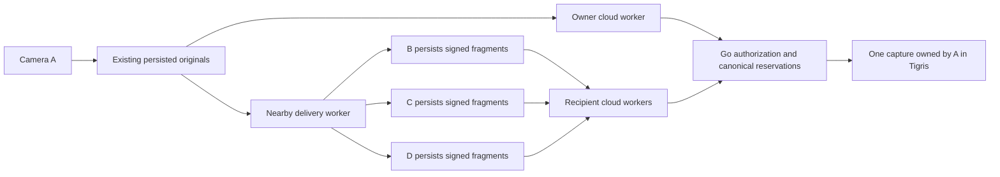

# Nearby replication and delegated cloud upload: engineering plan

> Historical plan. Wi-Fi Aware has replaced the Bonjour transport and manual peer-code flow described here; that runtime code and its endpoints are removed. See the [Wi-Fi Aware plan](wifi-aware-plan.md) for the current design and [pilot guide](nearby-pilot.md) for current verification.

Status: milestones 0–6 are implemented and pass native loopback/RustFS integration checks as of 2026-09-24. Physical-device and Tigris gates in milestone 7 remain open. See [the pilot guide](nearby-pilot.md). Code inspected at `311096f`; incorporates [PR #3](https://github.com/niteshbalusu11/streamvideo/pull/3), head `33b6e1a`, and the user's subsequent decisions. Platform research and the PR assessment are in [the research note](research/nearby-offline-sharing.md).

## 1. Outcome and scope

Implementation progress: [device identity and directional consent](nearby-identities.md) include registered TLS keys, native approval, and an offline cache. [Signed media records and storage](signed-media-protocol.md) include stable records from retained owner fragments, persisted camera ending intent, durable receiving, and Swift/Go interoperability and restart checks. The [relay backend](relay-api.md) now handles recipient authorization, canonical fragment/quota convergence, completion evidence, and deletion/revocation races behind a disabled-by-default switch. Combined storage reservations, native upload scheduling, three-recipient media transport, foreground lifecycle, received-copy UI and HLS viewing are implemented. Native checks pass; physical-device and Tigris acceptance remain open.

A records video or takes photos. During capture, A independently uploads to its cloud account and sends completed media objects directly to approved nearby phones B, C, and D. Recipients persist their copies and can immediately or later upload missing objects on A's behalf. Different phones may supply different portions; all contributions converge into one capture owned by A.

The release must support this complete recovery path, including A never reconnecting. A radio demo alone is not completion of the feature.

Decisions carried forward:

- Direct one-to-many connections. No peer forwarding, mesh routing, or uploader election.
- Preserve iOS 17 support; use `NWBrowser`, `NWListener`, and `NWConnection`, Bonjour, peer-to-peer Wi-Fi, and mutually authenticated TLS over TCP.
- Keep the existing encoder and exact persisted video/JPEG bytes. Do not re-encode for different recipients.
- Remotely approve enrolled devices and cache identities before an outage. First-time enrollment/approval still requires internet. Nearby discovery and recording-time authorization do not.
- Each recipient uses its own session and a recorder-signed grant. Recorder ownership is immutable; uploader identity is separate.
- All authorized devices can try uploading. Deduplicate per fragment at the server and storage write; overlapping network transfers are acceptable initially.
- Foreground receive and foreground retry after reopening are the first supported lifecycle. Do not promise receiving or automatic recovery from a force-quit app.
- Live viewing is included as a later milestone, independent of durable replication and cloud recovery. It must not hold up those two capabilities.

Proposed pilot defaults, to be validated rather than presented as platform limits:

| Policy | Initial choice |
| --- | --- |
| Concurrent nearby recipients | Up to 3 per sender; test 1, 2, then 3 |
| Active incoming sender | 1 per receiving phone; saved backlog can contain multiple recorders |
| Encoding | Existing approximately 1-second H.264/AAC fragments, 720 x 1280, 1.5 Mbps video + 32 kbps audio |
| Media object limit | Existing 12 MiB |
| Retained local media | Existing 3 GiB combined budget, with received media additionally capped at 1 GiB |
| Free-disk floor | Preserve existing 100 MiB, plus reservations for in-progress writes |
| Cloud account quota | Existing 10 GiB charged to the recorder, once per canonical object |
| Relay grant lifetime | 30 days from issue; reject longer lifetimes server-side |
| Relay allowance | At most 3 GiB per video grant; photo grants bounded to that photo; existing object/sequence limits apply |
| Recipient invitations | Single-use, 24-hour expiry; distinct from app-enrollment invitations |
| Cloud concurrency | At most 2 media uploads per phone, with original recording work prioritized |

Longer outages than the grant lifetime need renewed authorization from A. Expiration must leave saved copies intact and visibly local-only. These defaults need no new settings screen in the first pilot.

## 2. Existing code and required seams

| Existing module | What can be reused | Required change |
| --- | --- | --- |
| [Camera](../UploadVideo/Camera.swift), [SegmentWriter](../UploadVideo/SegmentWriter.swift) | Live encoding, JPEG capture, numbered init/media objects | Emit lightweight capture lifecycle events and durable-object availability; capture callbacks never wait for peer work |
| [UploadQueue](../UploadVideo/UploadQueue.swift) | Atomic staging, metadata/digests, file protection, retained owner media | Read committed objects independent of cloud acknowledgement; expose stable snapshots/read handles; add capture records without treating them as old object folders |
| [AppModel](../UploadVideo/AppModel.swift) | Foreground lifecycle, enrollment, owner upload workers | Coordinate nearby mode, identity setup, and relay worker lifetime; isolate relay failures from `captureBlocked` |
| [API](../UploadVideo/API.swift) | Owner session and JSON requests | Optional device identity on session, identity migration, peer approval and relay endpoints; bounded file upload support if proxy mode is selected |
| [CaptureLibrary](../UploadVideo/CaptureLibrary.swift), [PhotoLibrary](../UploadVideo/PhotoLibrary.swift) | JPEG display and contiguous-fragment MP4 export | Read received media with distinct local-owner/recorder identities; add live playback separately |
| [Go authorization and object routes](../server/api.go) | Invite-only accounts, owner authorization, reservation, quota, acknowledgement | Device-aware caller context and narrowly scoped relay routes; shared object validation/reservation implementation with explicit owner |
| [Database migrations](../server/migrations.go), [storage](../server/storage.go), [deletion](../server/deletion.go) | Unique capture/sequence, canonical random object keys, conditional PUT, verification, permanent deletion tombstones | Append migrations; add SHA-256-before-final-write guarantee for relays; preserve deletion races across all upload paths |

Keep the existing owner `acknowledged` field meaningful only for cloud verification. Do not overload it with nearby receipt or reuse the owner's upload queue as the recipient's upload identity.

Add focused Swift modules as their milestones need them:

- `DeviceIdentity.swift`: owns device-only signing/TLS keys, signing, verification, and registered identity. Callers never handle private-key bytes.
- `NearbySharing.swift`: starts/stops discovery and authenticated sessions, schedules delivery, and reports per-recipient progress. Private wire parsing and connection scheduling stay inside this module initially.
- `PeerStore.swift`: owns approval cache, sender delivery metadata, receiver grants/manifests/media, durable receipts, account partitioning, and recovery. It exposes committed media and pending relay work, not filesystem layout.
- `RelayUploadWorker.swift`: redeems grants and sends missing signed objects using the current recipient session. It cannot call owner-only media routes as A.
- `NearbyView.swift`: minimal recipient selection and Receive UI. `LivePlayback.swift` is added only with the playback milestone.

On Go, add `devices.go`, `peers.go`, and `relay.go`; extract common object operations into `objects.go` only when both owner and relay callers need them. Pass an explicit authenticated upload principal containing owner account, caller device, capture, and optional grant. Never substitute the recorder into the HTTP caller's account context or relax `owned()`.

## 3. End-to-end architecture



A fragment moves through independent states: committed on A; signing ready; saved on each recipient; verified in cloud. An owner cloud acknowledgement must not stop nearby delivery of that same fragment. A peer acknowledgement must not mark cloud storage complete.

The notification of a new fragment is only a wake-up hint. Every worker reconstructs its pending work from durable state after relaunch, so dropping a notification or terminating after a file commit cannot orphan media.

## 4. Device identity and approval

### Device setup and session migration

Create a dedicated P-256 signing key and a separate TLS identity per device/account. Store private material using non-synchronizing, device-only Keychain access. Use supported certificate tooling, such as Apple's `swift-certificates`, for the TLS certificate; do not hand-roll certificate encoding. Pin the approved public keys and require both peers to prove possession during TLS authentication. The certificate provisioning/import path is part of the first spike. [Apple identity guidance](https://developer.apple.com/documentation/technotes/tn3213-moving-from-multipeer-connectivity-to-network-framework)

Register through an authenticated, short-lived server challenge bound to the current session and proposed keys. Require proof of possession of both keys. Persist the generated identity before registration so a lost response retries the same device instead of creating another.

Append `devices` and nullable `sessions.device_id`. Atomically bind only the caller's existing session to its device after proof validation; repeat registration with the same identity is idempotent, binding to a different identity conflicts. Do not migrate all sessions belonging to one account together. Existing unbound sessions retain owner capture access but cannot use peer or relay routes until upgraded. Preserve current non-expiring sessions and account/admin permissions.

Replacement devices get new keys and approvals. Logout cancels networking before changing accounts; all caches and saved recipient media are partitioned by the local account and API environment. Missing keys disable sharing with a setup error while normal recording/upload remains usable. Device revocation prevents new authenticated relay operations; offline peers learn remote revocations on their next sync.

### Recipient approvals

Use separate `peer_invitations` and directional `peer_approvals` records. Bind the invitation to the selected enrolled recipient account; acceptance binds a specific recipient device. To identify the recipient without building a public directory, let an enrolled receiver share an app contact code containing its public account/device identifiers; resolve and validate that target at the server when creating the invitation. Consume the hashed invitation token and create the approval in one transaction. Require explicit receiver consent to saving and relaying A's media. Return public identities only to the participating authenticated accounts.

Cache approvals, public-key fingerprints, and allowed roles on both phones. Sender selection is separate from an accepted relationship. Either side can disable a relationship locally immediately and sync its revocation later. Local revocation closes matching sessions and cancels queued new sends. Do not expose device IDs, public keys, invitation tokens, or names in Bonjour advertisements.

## 5. Signed records and nearby protocol

Finalize one bounded, versioned wire specification before implementing both languages. PR #3 is unshipped: extend its proposed v1 to cover photos, a signed capture descriptor, and completion evidence. Use deterministic binary signed payloads, distinct message-domain prefixes, SHA-256, P-256 DER signatures, and base64url envelopes for HTTP. Never reserialize JSON to reconstruct the bytes being verified. Store the original signed payload and envelope for exact retries. Key grant idempotency by its random ID and signed-payload digest, not by ECDSA signature bytes; separately validate every supplied signature and registered key.

| Signed record | Required contents and behavior |
| --- | --- |
| Capture descriptor | Capture UUID, recorder account/device/key ID, video/photo kind, creation time; immutable; signed by the recorder |
| Recipient grant | Unique grant ID, descriptor digest, recorder and recipient device IDs, destination `primary`, upload-signed-material-only scope, issued/expiry times, byte allowance |
| Object manifest | Descriptor/capture identity, sequence, init/media/photo kind, length, SHA-256, current MD5 adapter field, duration/start time; same exact metadata used by A and every recipient |
| Completion record | Descriptor/capture identity, terminal reason (`stopped` or `interrupted`), last sequence, object count, total bytes; signed only after all included objects are durably committed |

The descriptor excludes precise location in the first version. Keep location on A and its owner upload path; section 7 specifies how relay-created captures accept A's later metadata without conflict. This avoids implicitly adding location disclosure to nearby approval.

Sign grants at recording start for selected recipients; signing/storage runs outside the capture callback. Sign each committed fragment asynchronously and persist its manifest before delivery. Photo captures use sequence 0 and kind `photo`; create their descriptor/grants after the JPEG has been persisted. Sharing enabled mid-recording can sign retained objects and issue a new grant for a newly selected already-approved recipient, within the same capture.

Persist terminal intent and sign the final record after successful writer finish and final enqueue. On interruption, only certify known persisted objects as an interrupted result. After a kill without terminal evidence, retain an unknown-ending state. Do not fabricate a normal Stop or infer completion from silence.

### Connection and messages

- Receiver advertises an app-specific Bonjour service only while Receive mode is active. Browser, listener, and outgoing connection parameters enable `includePeerToPeer`; do not force cloud connections onto the peer interface. This permits both the direct Wi-Fi path and an existing LAN path.
- Require Local Network access and declare the service in both Debug and Release Info.plist files. Trigger the first permission flow during nearby setup. Stop continuous browsing once selected peers are found; use bounded rediscovery attempts for missing peers. [Apple privacy guidance](https://developer.apple.com/documentation/technotes/tn3179-understanding-local-network-privacy)
- Use authenticated TLS before application messages. TLS identity must match a cached approved device; an advertised name never proves identity. Reject unknown peers and cap unauthenticated connection attempts.
- Use a length-prefixed envelope with protocol version and message type. Control records are bounded to 8 KiB; media data is transferred in chunks of at most 64 KiB. An object may be up to 12 MiB and is streamed into a staging file, not accumulated into unbounded memory.
- Message types: hello/capabilities, capture descriptor and grant, bounded receipt inventory, object begin/data/end, durable receipt, completion record, and bounded error/stop. Unknown versions or malformed lengths end the session safely.
- Keep one authenticated connection per selected peer. Reconnect requests a paginated inventory of saved sequence/hash pairs; retries of the same bytes succeed, conflicting bytes fail. Include init before media and retransmit it when the receiver lacks it.
- Interleave photo chunks and current video work so a large JPEG does not hold up all new video. Keep one bounded object window per media kind per peer. A stalled peer does not hold locks or memory needed by capture, cloud, or other peers.

### Late join and backlog

Prioritize initialization and new media for live replication, with a bounded share of transfer capacity for older missing fragments. When capture stops, drain retained gaps. Track sparse sequence sets, not just a highest sequence: a receiver with 1–10 and 20–30 must not acknowledge 1–30. If available throughput cannot keep up, show that peer as behind; stop scheduling further work to it when its resource limits are reached. Never silently discard originals or claim its archive is complete.

## 6. Durable storage, lifecycle, and user experience

Receiver commit sequence: validate authenticated sender and signed records; reserve disk budget; stream to staging while hashing; verify length/digest; persist media, manifest, grant and receipt metadata; atomically publish; only then send an acknowledgement. Specify the flush/directory-sync behavior in the storage implementation and test process-termination recovery. Atomic rename alone must not be described as a power-loss guarantee.

Keep originals and received media in separate directories and use `(local account, recorder account, capture ID, sequence)` to identify received objects. Do not set the recipient's session to A or let the ordinary owner worker pick up received files. Keep protected files excluded from iCloud backup; received footage is not automatically added to Photos. Viewing/export can reuse existing helpers where the sequence is contiguous; holes remain explicit.

Share disk-byte reservations across original and received writes, including in-progress staging, so independent queues cannot both spend the same free space. Apply the combined/local-receiver caps from section 1. Refuse new incoming media before compromising local capture. Do not evict unverified received copies automatically. For the first pilot, provide explicit local deletion, including a clear warning for media still awaiting cloud backup; automatic retention cleanup can follow separately.

Reading/sending a file must coordinate with deletion through a scoped read handle and cancellation. Deleting an owned capture cancels peer delivery and relay grants via the server tombstone; deleting a received local copy removes only that phone's copy and work. Neither action can erase exports or offline copies on another phone. Do not automatically call A's cloud delete route from a recipient's Gallery action.

On foreground activation: recover stores, start authorized workers, and sync approvals if possible. On background/lock: stop discovery, cancel peer sessions, finish/interrupt capture using existing behavior, and persist pending work. Reopen resumes by inventory and reservation. Do not use Bluetooth/audio background modes as a workaround for execution limits.

Receive mode must suspend the receiver's unused camera/location session; current `AppModel.activate()` otherwise starts its camera. Pending owner uploads can continue. Session invalidation or account switch cancels all old-account work and hides that account's received media. A recorder's expired grant or full quota must not log out the recipient or stop the recipient's own recording.

Minimal UI:

- Camera: Nearby control, selected recipients, small count/status. Recording starts even when nobody is available.
- Receive: opt in, show approved recorder, save progress and cloud status; keep the screen awake only during an explicitly active session.
- Received captures: recorder attribution, saved coverage, cloud progress, view/export and local delete. Never relabel received footage as the recipient's own capture.
- Use separate states such as `Receiving`, `Saved through 00:42`, `Gaps`, `Uploading`, `Cloud verified`, `Grant expired`, and `Receiver unavailable`. Show a whole-capture success only when final evidence and every required object are verified. Expanding status reveals recipient detail; keep technical identifiers out of the normal camera UI.

## 7. Backend ownership, data model, and delegated endpoints

Append migrations; do not rewrite existing migration strings. Suggested new records:

| Record | Essential invariants |
| --- | --- |
| `devices` | Unique identity, owning account, public signing/TLS identities, key IDs, active/revoked state |
| `peer_invitations`, `peer_approvals` | Hashed single-use token; fixed sender and intended recipient; accepted device, allowed roles, revocation |
| `relay_grants` | Unique grant ID, signed-payload digest and stored envelope, descriptor reference, caller binding, limits, expiry; identical payload retries return the same authorization |
| `relay_grant_objects` | Unique grant/sequence mapping; charge each grant once per distinct object and account quota once across all uploaders |
| Capture additions | Recorder device and signed descriptor when present; `owner_metadata_pending`; signed completion evidence and derived cloud-complete status |

Reuse `objects` and its existing unique `(capture_id, sequence)` and canonical storage key. Do not create B-owned and C-owned cloud captures or assign a new storage key per uploader. Existing account ownership remains authoritative. A conflicting capture ID belonging to another account never changes owner.

Illustrative HTTP routes, to be frozen with the protocol tests:

| Routes | Authorization and effect |
| --- | --- |
| `POST /devices/challenge`, `POST /devices/register` | Current enrolled session plus proofs; idempotent binding of that session |
| `POST /peer-invitations`, `POST /peer-invitations/accept` | Device-bound sender/recipient sessions; directional consent |
| `GET /peer-approvals`, `DELETE /peer-approvals/{id}`, `DELETE /devices/{id}` | Participant/self-owned identity management; no arbitrary cross-account revocation |
| `POST /relay-grants/redeem` | Recipient session, grant, signed capture descriptor; validates registered recorder key, approval, expiry, destination and limits |
| `POST /relay-grants/{id}/objects/reserve` | Signed object manifest; returns already-verified or upload authorization for the canonical object |
| `POST /relay-grants/{id}/objects/ack` | Verify existing bytes; response is repeatable after another uploader succeeds |
| `POST /relay-grants/{id}/completion` | Forward recorder-signed terminal evidence only; never accept the recipient's own claim that recording ended |
| `POST /captures/{id}/completion` | Owner forwards the same signed evidence for newly shared captures |

Use reservation of local objects as the initial missing-object query; add no broad capture-list/read permission to relay grants. Grant routes can return verification status of authorized objects without returning download URLs. Stable machine error codes distinguish expired grant, deleted capture, revoked approval, metadata conflict and quota; do not overload the owner's current `410` handling that deletes its queue.

### Relay-first capture creation and location

For a missing capture, redemption creates it under the signed recorder account with the signed kind/time and `owner_metadata_pending = true`. Check permanent deletion tombstones before creation; never resurrect a deleted capture, even if deletion preceded the first upload.

For an existing capture, require matching owner/kind and immutable shared descriptor once attached. New shared owner uploads submit the same descriptor so either ordering converges. Relay calls never write location.

Change the owner-only create/update operation narrowly: an actual owner may fill or explicitly omit location once for a relay-created capture whose metadata is pending, then clear that flag in the same transaction. Preserve current conflict behavior for other captures and later mismatches. Test owner-first and relay-first orderings, with location enabled and disabled. This fixes the concrete current-master integration issue identified in PR #3.

### Completion semantics

Store valid signed terminal evidence even if some objects have not arrived. Derive cloud completeness from that record plus all expected sequences, correct kinds, byte totals, and verified objects. Validate terminal evidence against already reserved objects and reject conflicts or out-of-range later sequences. Missing final evidence means ending unknown; interrupted evidence means recovered footage, not a normal completed recording.

Existing legacy captures keep their behavior and remain recoverable without finalization. The current owner-only `/finish` flag is not sufficient proof of full storage for shared captures. No relay gains that unrestricted route; it only carries A's signed evidence.

## 8. Concurrent uploads and storage integrity

For every owner/recipient attempt:

1. Authenticate the real caller; validate the grant if delegated. Resolve recorder ownership explicitly. Recheck active account/device/approval, expiry, limits and tombstone in the reservation transaction.
2. Insert or load the canonical capture/sequence object. Exact metadata retries reuse it; conflicting bytes/timing fail. Count account storage once and each grant's distinct-sequence allowance once. Keep storage I/O outside long database transactions; the current database serializes metadata using one connection.
3. If already verified, return success without another upload. Otherwise authorize writing only the expected bytes to the canonical key.
4. Verify persisted storage before acknowledging. Lost PUT/ack responses and duplicate writes reconcile to that same object. An HTTP `412` is a reason to check stored bytes, not a successful acknowledgement by itself. Retry transient/conflicting-storage outcomes with bounded backoff and fresh authorization when needed.

Use conditional create (`If-None-Match: *`) and expected SHA-256 enforced before bytes occupy the final immutable key. S3 documents both conditional PUT and SHA-256 checksums; its contract is not evidence that our Tigris configuration has passed these tests. [S3 PutObject](https://docs.aws.amazon.com/AmazonS3/latest/API/API_PutObject.html)

**Milestone 0 selects exactly one shipping relay path:**

- Preferred: direct short-lived presigned PUT with the expected SHA-256, length and conditional-write headers covered by the signature, if concurrent-write and corrupt-body tests pass on both actual Tigris and local RustFS.
- Fallback: bounded upload through Go. Stream at most the authorized object length to a temporary file, verify the expected hash, and only then write the final object. Return a relay-proxy upload instruction rather than a storage URL. Bound concurrent proxy bodies/temp disk, recheck permission before commit, and clean failed temporary files. This costs server bandwidth but avoids dependence on unverified storage checksum behavior.

Do not ship a relay path that writes untrusted bytes to the immutable final key and only afterward discovers the digest was wrong. Do not implement both paths merely for flexibility; document the storage spike result and implement the selected path. If the provider's atomic conditional behavior fails, use a verified server-mediated commit design and rerun owner/relay races before release.

Preserve deletion serialization and grace periods. Reservations/commit authorization have a defined ordering with deletion; every in-flight write capable of completing after deletion must have a bounded lifetime covered by cleanup. Retain its key/metadata until cleanup is safe. A revoked grant blocks new upload rights; already issued storage URLs can remain usable until their short expiry. A late acknowledgement may confirm already-authorized bytes without issuing new rights.

Recipient uploads start immediately when connectivity and foreground runtime allow. Use bounded retry/backoff; skip completed objects and continue other captures when a specific grant is terminally blocked. Owner and relay transfers share the two upload slots, with owner video priority during recording. A relay error must not reuse the current owner worker's stop-camera/logout behavior.

No leases or leader election initially. If duplicate traffic proves significant, a later per-fragment expiring lease can reduce it; deduplication remains required even then.

## 9. Implementation milestones and acceptance gates

Each row is a reviewable slice. Milestone 0 has started on `codex/nearby-feasibility`; later branch names are suggested implementation boundaries.

| Order / suggested branch | Work | Acceptance gate |
| --- | --- | --- |
| 0. `codex/nearby-feasibility` | Two-device authenticated TCP/TLS spike, public-key provisioning, Bonjour permission setup; concurrent/corrupt PUT storage probe | Real phones exchange bytes with no router/internet and reject the wrong key; choose direct-checksum or proxy upload path from actual storage results |
| 1. `codex/peer-identities` | Device migrations, proofs, session binding, enrollment compatibility, directional peer invitations and local approval cache | Two separately enrolled devices approve while apart and authenticate offline later; retries, expiry, account switch and revocation tests pass |
| 2. `codex/signed-media-records` | Swift/Go encoding and signature fixtures; signed descriptors/grants/objects/completion; durable sender capture records and receiver store | Swift-generated records verify in Go; tampering fails; video and photo signed records survive termination/relaunch without changing existing owner uploads |
| 3. `codex/relay-uploads` | Shared object operations, relay routes, chosen storage path, relay-first location hydration, deletion/completion semantics, Swift relay worker | Seeded B/C queues reconstruct A's capture while A stays offline; simultaneous A/B/C uploads yield one object/quota charge; wrong bytes cannot occupy a final key |
| 4. `codex/nearby-replication` | Peer framing, persisted delivery, resume inventory, live/backfill/photo scheduling, multiple outgoing recipients | A records and uploads while B/C/D save fragments; a slow/disconnected recipient does not stall the others; queued recipients use milestone 3 immediately or later |
| 5. `codex/nearby-recovery-ui` | Nearby/Receive/Received UX, lifecycle coordination, disk limits, deletion, precise saved/cloud states | A disappears and remaining devices recover all collectively held fragments under A; restart, disk pressure and revoked/expired grants behave truthfully |
| 6. `codex/nearby-live-playback` | Receiver-local HLS playlist/player over verified incoming fragments, JPEG display, init/keyframe handling, gaps and live-edge behavior | Receiver continuously watches before A stops, with synchronized audio; decoder/player errors do not disrupt storage or upload; measure delay on target phones |
| 7. `codex/nearby-pilot-validation` | End-to-end device matrix, deployment/migration rehearsal, metrics and release documentation | All core recovery criteria below pass on RustFS and Tigris; 1/2/3-recipient limits are backed by measurements |

Dependency order: 0 → 1 → 2; 3 and 4 both build on 2; 5 integrates 3 + 4; 6 follows stable receiving and is independent of the core recovery release; 7 validates the shipping scope. The complete requested backup feature requires milestones 0–5 and 7. Continuous viewing requires milestone 6 too.

For live playback, start with a loopback-only HTTP HLS feed into `AVPlayer` using already persisted fMP4; current Gallery snapshot export is not a live player. Validate it rather than assuming AVPlayer follows an appended MP4. Keep playlists behind the receiver's verified media state; do not concatenate across missing fragments as if contiguous. Aim for a few seconds of delay, not sub-second conferencing. This approach and target remain an experiment, not an Apple performance guarantee.

## 10. Verification plan

Tests exercise real module interfaces and failure behavior, not private implementation details.

### Automated Go/Swift and storage checks

- Golden records in shared fixtures: signed bytes, public keys, valid signatures, invalid signature, wrong recipient/account/key, modified capture/sequence/hash/length/timing, non-finite timing, unsupported version, trailing bytes, oversized controls and replay conflicts. Check future `issued_at` with a bounded skew allowance and the 30-day maximum lifetime; device sessions themselves stay non-expiring.
- Migration from current DB and an old saved app session; repeated device registration, invitation double acceptance, one-session binding, existing owner/admin permissions and disabled-feature compatibility.
- Concurrent A/B/C reservation, duplicate PUT, lost PUT response, lost ack, server restart after PUT but before ack, differing metadata, per-grant/account quota near limits, and expired/revoked grants during retries. Confirm total canonical object count and quota, not just response codes.
- Real storage: signed SHA-256 rejection before final-key occupancy, same-key simultaneous writes, unsigned/mismatched required headers, retry after corruption, and owner/relay races. RustFS success alone does not release the Tigris path.
- Relay-first capture creation then A's location-bearing upload; owner-first reverse ordering; deletion before creation, during reserve/PUT/ack, after a completion record, and after restore. Tombstones survive and block resurrection.
- Process-kill injection around receive writes, grant/manifest publication, durable receipt, signature persistence, and cloud acknowledgement. Relaunch inventories must never claim missing files as saved. Duplicated network messages must not consume disk twice.
- Complementary copies: A cloud has init + sequences 1–30; B has init + 1–60; C has init + 40–90. Recover init + 1–90 as one A-owned capture, reject a forged completion, and remain explicitly partial if sequence 70 or final evidence is absent. Photos use the same authorization/deduplication checks at sequence 0.
- Expired grants and one malformed received capture do not block other pending recipients/captures or the local owner's recording. Logout and account switching cancel and partition all work.

Extend existing Go test files and add focused identity/peer/relay tests. Add Swift probes for signature interoperability and PeerStore crash/resume beside the existing probes; register new source dependencies in the Xcode project and verification script. Run the existing checks during implementation:

```sh
cd server
go test -race ./...
```

From repository root, with the documented local RustFS setup:

```sh
./tools/verify-local.sh
xcodebuild -project UploadVideo.xcodeproj -scheme UploadVideo \
  -destination 'generic/platform=iOS Simulator' CODE_SIGNING_ALLOWED=NO build
```

Simulator/localhost probes verify logic and builds, not peer-to-peer radio behavior.

### Physical iPhone matrix

1. Offline enrollment already completed; enable Wi-Fi, disable cellular, forget/disconnect access points. A discovers and sends to B, then B/C, then B/C/D. Confirm the transfer is not accidentally using a shared router.
2. A has cellular internet while its direct Wi-Fi links deliver to recipients. Observe cloud and per-recipient progress during the same recording. Repeat with internet only on one recipient, then on several, including simultaneous owner/recipient uploads.
3. Reproduce a 60-second outage, late joining, a slow recipient, range loss/reconnection, and a long backlog. Receiving phones retain acknowledged objects; photo bursts do not starve video. Decode received media before Stop.
4. Kill A during recording and keep it offline. B/C reconnect later and recover the available union under A. Repeat with normal Stop/final evidence and with interrupted/unknown ending. Verify gaps are visible and original ownership is unchanged.
5. Lock/background/force-quit each role, revoke/block a peer, deny Local Network, disable Wi-Fi, hit receiver quota and low disk, and restart after receipt. Verify no false saved/cloud status and no promise of suspended execution.
6. Run a 30-minute session at each supported recipient count, including photo capture and the app's dual-camera mode on capable phones. Record discovery time, durable-receipt lag, queue growth, useful throughput, duplicate cloud bytes, recording gaps, memory, battery and thermal state.

Initial healthy-link target: 95th-percentile durable-receipt lag within 5 seconds of sender fragment commit after connection, with no sustained queue growth at the existing bitrate. Measure clock-independent sender commit-to-receipt round trips; do not subtract unsynchronized phone clocks. This is an engineering target to accept/revise from measurements. Three recipients require about 4.596 Mbps of duplicated media payload before overhead; simultaneous A cloud upload adds another 1.532 Mbps. Radio contention, retries, and photos increase demand.

## 11. Rollout, observability, and completion

Ship additive server migrations and owner-compatible routes first. Keep peer/relay admission disabled until device and integrity gates pass, then enable for a small enrolled pilot. Existing clients and existing recordings keep working. Disable discovery/new grants to contain issues without deleting durable queues or turning off normal owner uploads; stop new relay authorizations if an integrity issue is found. Previously issued URLs have a bounded residual lifetime.

Log bounded, structured outcomes: connection/auth rejection, receipt lag/gaps, grant rejection class, reserve conflict, verified duplicate, quota and store mismatch. Avoid raw media, private keys, grant payloads, invite/session tokens, presigned URLs, precise location and permanent identifiers in discovery logs. Preserve enough per-capture/device attribution in protected server records to diagnose uploads without exposing it on the radio.

Test database backup/restore with device keys' public registrations, approvals, grants, usage counters, completion records and tombstones. Preserve old public verification identities needed by unexpired grants; do not silently rotate them out. Server rollback must use a schema-compatible build or the documented restore procedure, not blindly deploy a binary that rejects the newer migration version.

The feature is complete when:

- Video fragments and photos reach approved peers during capture, concurrently with A's normal cloud upload, with no source-phone network dependency.
- One sender reaches the validated pilot recipient count and unsupported/slow peers cannot block the rest.
- With A permanently offline, the server accepts the union of valid fragments from recipients into A's capture, skips verified duplicates, and preserves partial/unknown-ending states honestly.
- Tampering, incorrect ownership, forged recipients, quota inflation, revocation and deleted-capture resurrection are rejected.
- App/server restarts preserve every acknowledged local/cloud object and resume authorized work while execution is available.
- The minimal UI distinguishes nearby saved copies, pending cloud work and fully verified coverage; physical-device results and actual storage tests are recorded in the device checklist.

Implementation status (2026-09-24): the complete native send/receive/relay/playback flow is implemented. Automated checks cover three authenticated loopback recipients with actual audio/video, reconnect, live viewing before Stop, RustFS recovery without the recorder, complementary copies and local deletion. See [the pilot guide](nearby-pilot.md) for exact evidence and installation. Production relay admission stays disabled; offline radio, sustained device performance and actual Tigris checks are still release gates.
