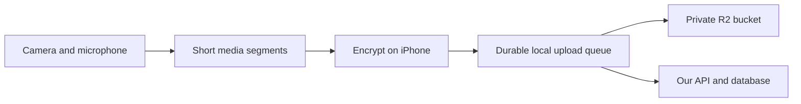

# Invite-only authentication and backend research

Updated September 24, 2026. Research and proposed architecture; no backend has been provisioned or implemented. Primary sources are linked beside relevant claims. Current requirements: a server we control for account data, physical QR invitations, no email delivery, native iOS, and ongoing encrypted media uploads. Cloudflare R2 is the proposed media store.

**Recommendation: one small API service, a database we operate, and private R2 storage.** For a small pilot, I would start with Go and SQLite on the same host, plus a small admin command for issuing/revoking invitations. This language/database choice is a recommendation, not a user-selected stack. Keep accounts minimal: random identifiers, membership status, sessions, and recording ownership. No name, email, phone number, or external identity provider is required.

| Component | Responsibility | Data |
| --- | --- | --- |
| iPhone app | QR enrollment, capture, encryption, durable upload queue, playback | Session credential and media keys in appropriately protected local storage |
| Our API | Invitation redemption, session validation, ownership checks, R2 authorization | Account and recording metadata |
| Our database | Durable application state | Accounts, hashed invites/sessions, recording and segment records |
| Private R2 bucket | Store uploaded media objects | Encrypted segments and opaque object identifiers |

The baseline assumes a small initial audience and administrator-issued invites. Hosting provider and media-key recovery remain undecided. Operating our own software on a rented server does not by itself make its host unable to access the running system. R2 is also a third party: the intended boundary is encrypted media there, with account records and their ownership mapping in our database.

**Physical invitation flow**

1. An administrator creates an expiring invitation using a trusted server-side admin command. Generate a high-entropy random secret, encode it in a QR, and keep only a hash plus state/expiry in the database.
2. The invitee installs the app and uses its “Scan invite” screen. For the pilot, scan inside the app and submit the token to a fixed HTTPS API endpoint. The QR must not choose an arbitrary server to receive credentials.
3. The server validates the invitation and, in one transaction, consumes it and creates a random account ID with an independent session credential.
4. The app stores the session credential in Keychain. Normal launches go straight to the camera while that credential remains valid.
5. Every protected API call checks the stored session, its expiry, active membership, and resource ownership.

This is a proposed use of standard random-token authentication. OWASP recommends cryptographically random, opaque session identifiers and protecting sessions over TLS. Use established session tooling where suitable and standard randomness/hashing libraries; do not invent a signing or encryption protocol. A 32-byte cryptographically random value is a reasonable proposed size for each independent invite and session secret. Session credentials travel in authorization headers to our API, never to R2 or logs. [OWASP session guidance](https://cheatsheetseries.owasp.org/cheatsheets/Session_Management_Cheat_Sheet.html)

Single-use, expiry, secure storage, and resistance to guessing are standard properties for bearer enrollment/recovery secrets. Applying those properties to invitations is our design judgment; OWASP's cited document specifically addresses recovery tokens. Rate-limit redemption attempts and never include raw tokens in telemetry. [OWASP token guidance](https://cheatsheetseries.owasp.org/cheatsheets/Forgot_Password_Cheat_Sheet.html)

**The QR authorizes enrollment; the session authorizes later requests.** The original QR stops working after redemption. Someone who photographs an unused QR can redeem it first, so physical delivery plus single use does not prove the redeemer's personal identity. For the pilot, issuing/scanning the QR together with the intended person is the simplest operational control. Concurrent redemption must create exactly one enrollment.

Keep only hashes of the random bearer secrets server-side and perform all status checks there. An opaque database-backed session is a simpler proposed fit than JWT access tokens here, because revocation already requires consulting our database. The token is stored on a particular device, but is **not cryptographically bound to that device**: possession of a stolen token would authorize requests until expiry/revocation. Choose an explicit session lifetime; in the simplest pilot, expiry requires another approved enrollment.

Use non-synchronizing Keychain storage and an appropriate `ThisDeviceOnly` accessibility class. Apple's `AfterFirstUnlockThisDeviceOnly` class supports access after the first unlock following reboot and does not migrate to a new phone, which is relevant for background uploads. Choose the most restrictive class compatible with the tested upload behavior. This avoids silently introducing iCloud credential synchronization. [Keychain accessibility](https://developer.apple.com/documentation/security/ksecattraccessibleafterfirstunlockthisdeviceonly), [sync control](https://developer.apple.com/documentation/security/ksecattrsynchronizable)

**Lost phones and failed enrollment**

An administrator can revoke a lost phone's session and issue a new single-use QR tied to the existing account, rather than creating a separate account with no access to its recordings. The administrator must have a way to identify the correct account through the existing physical relationship/account reference; recovery cannot grant access based only on knowing a public account ID.

If enrollment commits but its response is lost before the phone stores the credential, the initial pilot can use admin-assisted revocation/reissue. Do not make the consumed QR generally reusable to solve retries. A more automatic enrollment-retry protocol can be designed if that failure proves common.

Account recovery restores authorization; it does not restore the keys needed to decrypt recordings. The key-recovery decision below is therefore necessary independently of the invitation design. Passkeys or authenticated device-to-device enrollment are possible later improvements, not initial requirements.

**Why a small server is sufficient**

Go includes HTTP client/server support in its standard library. A single deployable API plus local SQL storage is a reasonable small-service design. We still need a maintained database driver, migrations, HTTPS deployment, and appropriate operational tooling; Go does not supply the whole application. [Go HTTP package](https://pkg.go.dev/net/http)

SQLite avoids operating a separate database service and is suitable for an application server with local storage and modest write concurrency. It permits only one writer at a time. Use short transactions and local durable disk; WAL mode supports concurrent readers/writer but cannot be shared across network-mounted multi-host deployments. Choose self-hosted Postgres instead if measured segment-metadata writes or multiple API hosts require it. This is a workload-dependent recommendation, not a throughput claim. [SQLite use cases](https://sqlite.org/whentouse.html), [WAL constraints](https://sqlite.org/wal.html)

We own patching, availability, and backup restoration. Use consistent database snapshots with SQLite's backup facilities, encrypt backups under keys we control, and test restores. A raw copy of only the main database file while WAL writes are active is not a sufficient backup procedure. Where backups are stored must follow the same account-data boundary. [SQLite backup API](https://sqlite.org/backup.html), [WAL files](https://sqlite.org/wal.html)

The minimum server surface is invitation redemption, session/account revocation, recording creation/listing, segment authorization/acknowledgement, and authorized retrieval/deletion. Keep invitation issuance in an admin command initially. Redis, queues, microservices, and a general-purpose identity server are not justified by the current requirements.

**Direct encrypted uploads to R2**

The app asks our API to authorize a small batch of upcoming segment uploads. After checking session, ownership, and quota, the server reserves opaque object IDs and returns short-lived presigned PUT URLs. Downloads use separately authorized GET URLs. R2 credentials stay on our server. Persist intended object references before issuing URLs so accepted uploads remain discoverable even if the phone disappears before acknowledging them.

Cloudflare documents presigned URLs for object-specific operations, including PUT and GET. They are reusable bearer authorizations until expiry, not one-use tokens, and do not consult our session database. Revoking an account stops new URL issuance; previously issued URLs retain their validity window. Use short expiry, narrow object scope, and bound the amount authorized ahead of time. [R2 presigned URLs](https://developers.cloudflare.com/r2/api/s3/presigned-urls/)

The protocol must reconcile a successful upload whose acknowledgement is lost. Retry the same ciphertext under its reserved identifier, verify object presence/size through the storage API before counting it as stored, and define overwrite/integrity behavior during implementation. A private bucket prevents public reads; quotas and server-side authorization remain our responsibility.

R2's default at-rest encryption uses Cloudflare-managed keys. To keep footage unreadable to Cloudflare, encrypt on the iPhone before upload and never provide usable media keys to R2. Use opaque object names and exclude names, emails, GPS, or other unnecessary plaintext metadata. [R2 encryption](https://developers.cloudflare.com/r2/reference/data-security/)

Direct uploads still expose traffic metadata to Cloudflare. Its documented access-log fields include client IP, request time/path, and object size. This design protects media contents and avoids sending our account database; it does not provide anonymity from the storage provider. [R2 request metadata](https://developers.cloudflare.com/r2/buckets/data-access-logs/)

**How live encrypted upload changes the design**

Uploading a finished movie with a resumable SDK does not satisfy this app's requirement. The proposed path is:

Apple's `AVAssetWriter` can output fragmented MPEG-4 segments through delegate callbacks, including an initialization segment and subsequent media segments. That supplies the native foundation for uploading before recording ends. Start by prototyping roughly 2–4-second segments; that interval is a proposal to measure, not a latency guarantee. [Apple segment-writing walkthrough](https://developer.apple.com/videos/play/wwdc2020/10011/), [delegate API](https://developer.apple.com/documentation/avfoundation/avassetwriterdelegate)

Proposed behavior: encrypt and persist each completed segment, upload it as a separate immutable object, and record acknowledgement. Retain initialization information and ordered segment metadata incrementally. Use stable recording/segment identifiers so retries can reconcile an upload whose response was lost. Recovery must work with a partial recording even if the app never sends a final “finished” message. Already accepted objects should remain discoverable if the phone disappears. Only unuploaded/buffered material is necessarily exposed to device loss; actual protection delay includes segment production, queue backlog, and network time.

Separate segment objects are preferable for the first experiment to a single unfinished multipart object. S3 assembles the object when multipart completion occurs; R2 multipart parts have a 5 MiB minimum except the last part. Separate small objects avoid coupling recoverability to a final multipart completion request. [Multipart completion](https://docs.aws.amazon.com/AmazonS3/latest/userguide/mpuoverview.html), [R2 upload limits](https://developers.cloudflare.com/r2/objects/upload-objects/)

The API handles authorization and metadata. The phone handles media encryption and direct R2 transfers. This keeps video bandwidth off the small server, but new upload authorizations still depend on its availability. An encrypted local queue must survive API or network outages.

Background uploading and background recording are different constraints. Apple supports background URLSession uploads from files, while the ordinary camera session is interrupted in the background. Plan for foreground capture and durable retry of already-produced encrypted files. Background scheduling is not a promise of immediate upload. Verify SDK behavior on a physical iPhone; the SDK upload call alone does not establish background resilience. [Background transfer constraints](https://developer.apple.com/documentation/foundation/downloading-files-in-the-background), [camera interruption](https://developer.apple.com/documentation/avfoundation/avcapturesession/interruptionreason/videodevicenotavailableinbackground)

**Encryption and recovery need an explicit decision**

TLS and provider-managed encryption at rest protect different boundaries from encrypting before upload. To keep media unreadable by our backend, encrypt on the phone and keep usable decryption keys out of server possession. Object storage can hold ciphertext without understanding it. [Client-side encryption distinction](https://docs.aws.amazon.com/AmazonS3/latest/userguide/UsingClientSideEncryption.html)

CryptoKit's AES-GCM provides authenticated encryption. A proposed design uses a random recording key, a unique nonce for each encrypted segment, and authenticated recording/sequence identifiers. Persist ciphertext for retries rather than reusing a nonce with changed plaintext. Design the recording manifest to detect missing/reordered/truncated content. This is a design direction requiring verification, not a complete reviewed encryption protocol. [CryptoKit AES-GCM](https://developer.apple.com/documentation/cryptokit/aes/gcm)

The consequential question is recovery after losing the recording phone. If the only key is on that phone, the cloud may preserve the footage but the user cannot decrypt it. Issuing another enrollment QR does not restore that key. We need a separately designed key recovery/sync mechanism if device-loss recovery is part of the promise. Possible directions include separately retained user-held recovery material or authenticated transfer from an existing device; neither is selected or validated here. Allowing our service to hold recovery keys is simpler operationally but gives it decryption capability.

If only the user holds keys, playback/export must decrypt on an authorized client; server-side transcoding and thumbnails cannot operate on opaque ciphertext. Encrypt sensitive thumbnails too. Metadata such as account identity, object sizes, and upload times can still be visible to the service. These are implications of the proposed design, not extra provider features.

**Cost and verification**

R2 Standard currently lists $0.015/GB-month, no direct internet egress charge, $4.50/million Class A operations, and $0.36/million Class B operations, with billing-unit rounding. Monthly free allowances include 10 GB-month, one million Class A operations, and ten million Class B operations. A steady 1,000 GB stored is approximately $14.85/month after the storage allowance, plus operations, our server, and backups. Small segments increase request counts. [R2 pricing](https://developers.cloudflare.com/r2/pricing/)

At an assumed total encoded bitrate of 8 Mbps, one hour is about 3.6 GB; one hundred people filming five minutes daily produce about 900 GB in 30 days, before overhead. These are arithmetic examples, not measured app behavior. Retention determines storage growth. Hosting costs are not estimated until we choose where to operate the server.

Before implementation, settle the server language/hosting and media-key recovery. Validate the proposed design in two small experiments:

1. **QR enrollment and authorization:** successful enrollment; expired/revoked/reused QR rejection; concurrent redemption yielding one account; session persistence across restart; old-session rejection after revocation; ownership isolation; admin re-enrollment into the same account; lost enrollment response; no secrets in logs.
2. **Live upload and recovery:** physical iPhone capture with encrypted objects arriving before recording ends; network/API outage; app termination; storage success followed by lost acknowledgement; expired presigned URLs; partial-recording reconstruction; second-device decryption with the chosen recovery mechanism. Measure delay, backlog, battery/thermal behavior, and database write pressure.

Research verification: primary documentation was inspected; auth and storage choices above are proposed designs. No hosted services were created and no runtime prototype was tested.
