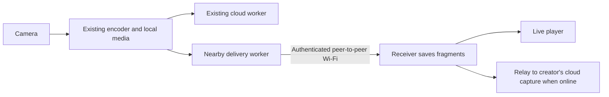

# Nearby offline live sharing on iPhone

Research date: 2026-09-24. Platform research and PR design review; no implementation or physical-device performance tests. Recommendations and proposed targets below are engineering judgments, not measured guarantees.

The subsequent [engineering plan](../nearby-sharing-plan.md) defines the implementation sequence, proposed pilot defaults, protocol changes, and release gates based on the user's clarified requirements.

## Recommendation

Use **Network.framework + Bonjour + `includePeerToPeer` with mutually authenticated TLS** for this app's first version. It fits the existing iOS 17 minimum and PR #3's remote preapproval requirement. Start with one sender and one receiver, then validate two receivers. Keep Wi-Fi Aware as an optional later transport for supported iOS 26+ phones when its nearby system-pairing flow is acceptable. Neither approach needs internet or a router during transfer. [Apple Wi-Fi overview](https://developer.apple.com/documentation/technotes/tn3111-ios-wifi-api-overview)

Apple recommends Network.framework for new networking code; Multipeer Connectivity was deprecated in 2026. Use the older `NWBrowser`/`NWListener`/`NWConnection` APIs for the iOS 17 baseline, rather than copying new iOS 26 examples verbatim. [Apple networking guidance](https://developer.apple.com/documentation/technotes/tn3151-choosing-the-right-networking-api), [migration guidance](https://developer.apple.com/documentation/technotes/tn3213-moving-from-multipeer-connectivity-to-network-framework)

## Confirmed product direction: one recorder, multiple backup recipients

The user's follow-up clarifies the desired topology as A → B, A → C, A → D. Multi-hop forwarding is out of scope. The central outcome is preserving footage during capture and letting any approved recipient later upload on behalf of A. Continuous viewing can be a separate part of the experience; it must not delay the durable-replication and cloud-recovery path.

The capture always belongs to A's account, regardless of who sends its bytes to the server. A generates its capture ID offline, signs capture/fragment metadata, and gives each approved device its own upload-only grant. B authenticates with B's own session and presents A's authorization; B never needs A's account token or bucket credentials. The API resolves and validates ownership from the signed grant and registered device identity. An unsigned `owner_id` on a recipient-created file is not proof of ownership or authorization.

**Recommended initial concurrency policy: every authorized holder may attempt upload when it has connectivity and app execution time; the server commits each fragment once.** There is no elected uploader for the whole recording.

1. B asks the API to reserve `(capture_id, sequence)` using A's signed expected metadata. If that fragment is already verified, B skips sending it.
2. If absent or not verified, the API returns the existing canonical object reservation or atomically creates one. Retries with identical metadata share that reservation; different hashes or metadata conflict. Account quota counts each canonical fragment once; relay grants independently enforce their allowances.
3. B and C may both receive permission before either upload finishes. Correctness must be enforced at the final write, not by a preceding existence check. Use atomic create-only writes to the same canonical key, with integrity checked before bytes can occupy that key. S3's documented `If-None-Match: *` behavior makes the first completed write succeed and subsequent same-key writes fail with `412`; validate equivalent behavior on the actual Tigris deployment. [AWS conditional writes](https://docs.aws.amazon.com/AmazonS3/latest/userguide/conditional-writes.html)
4. A duplicate-write response or lost upload/ack response triggers reconciliation. The API verifies the stored size and A-signed SHA-256, then reports the fragment complete to any authorized holder. `412` alone is not proof that correct media exists. Keep pending local bytes when verification is missing or unavailable.
5. Recipients contribute whichever fragments they have. B can supply the first part and C the later part; overlapping fragments deduplicate. The server assembles one logical capture under A, retaining uploader identity only as audit information. A's normal upload path participates in the same deduplication.

The existing [database schema](../../server/migrations.go), [reservation/acknowledgement API](../../server/api.go), and [storage adapter](../../server/storage.go) already provide a unique `(capture_id, sequence)`, canonical object keys, conditional PUT, and post-upload verification for owner uploads. Delegated recipient authorization is still unimplemented. PR #3's integrity gate remains mandatory: confirm Tigris enforces the signed SHA-256 on direct uploads, or verify relay bytes through the Go API or isolated staging objects before committing them. Current post-upload SHA-256 verification alone is not enough to prevent an invalid immutable object from blocking recovery.

This policy can waste upload bandwidth when two recipients transfer the same fragment concurrently, but it avoids depending on one phone's availability. If measurements justify it, add a short server-side lease per fragment so other uploaders work on different missing fragments. Leases must expire for takeover after a stalled upload; final writes still need deduplication because an old upload may complete after its lease expires. Do not lock an entire recording to a single uploader.

Preserve a recorder-signed final sequence/count when A stops normally. The server should report a complete capture only when all required fragments are verified against that completion record; otherwise report the recovered portion with an unknown or incomplete ending. A relay's upload-only permission must not let it invent an ending. Grant expiry also bounds how long recipients can rescue footage offline, so choose its lifetime deliberately and keep valid local copies if cloud authorization expires.

The honest durability signal is “saved on N nearby devices,” based on persisted data and manifest acknowledgements. Replication reduces the chance of loss; it cannot guarantee preservation before a fragment reaches another device, after every copy is deleted/lost, or for the unfinished fragment at interruption.

## Available transports

| Option | What it provides | Fit for this app |
| --- | --- | --- |
| Bonjour + Network.framework, peer-to-peer enabled | Apple peer-to-peer Wi-Fi and ordinary LAN discovery/connections | Recommended first implementation; app designs trust and admission |
| Wi-Fi Aware + Network.framework | Direct authenticated, encrypted Wi-Fi connections, explicit device pairing, performance controls | Later option for supported iOS 26+ devices |
| Multipeer Connectivity | Higher-level discovery, invitations, data/streams/files | Avoid for a new long-lived implementation because Apple deprecated it in 2026 |
| Core Bluetooth / bitchat-style BLE mesh | Low-bandwidth messages relayed between nearby phones | Potential later control/presence channel; unsuitable as the primary live-video transport |

The first three rows follow Apple's [networking API guidance](https://developer.apple.com/documentation/technotes/tn3151-choosing-the-right-networking-api). The BLE judgment follows bitchat's protocol design around constrained bandwidth, small fragmented packets, and application-level forwarding; this is not a video-throughput benchmark. [bitchat protocol source](https://github.com/permissionlesstech/bitchat/blob/main/bitchat/Protocols/BitchatProtocol.swift)

### Wi-Fi Aware details

- Introduced in iOS 26. Apple lists iPhone 12 and later; gate the feature with `WACapabilities.supportedFeatures`, rather than assuming availability from OS version alone. Devices connect without an access point or internet. The framework permits connections while the app has foreground or background runtime; it does not itself grant unlimited background execution. [Framework](https://developer.apple.com/documentation/wifiaware), [capability API](https://developer.apple.com/documentation/wifiaware/wacapabilities)
- Add the Wi-Fi Aware capability (`com.apple.developer.wifi-aware`, `Publish`/`Subscribe`) and declare services in `WiFiAwareServices`. This is documented as an Xcode capability, not as a special approval-only entitlement. [Entitlement](https://developer.apple.com/documentation/bundleresources/entitlements/com.apple.developer.wifi-aware)
- App-to-app pairing uses DeviceDiscoveryUI: the sender presents pairing UI, the receiver selects it and confirms a PIN. Paired devices can reconnect without repeating pairing. Links are authenticated/encrypted at the Wi-Fi layer. `.realtime` performance mode plus `.interactiveVideo` service class trades more battery use for lower latency; performance reports expose throughput, latency, and signal metrics. Apple publishes no universal video bandwidth or receiver-count guarantee in this material. [WWDC25 session](https://developer.apple.com/videos/play/wwdc2025/228/)
- Important compatibility trap: **Wi-Fi Aware with QUIC is unsupported before iOS 27**. For an iOS 26 prototype, use TCP/TLS for reliable chunks, or a separately designed UDP media protocol if low latency justifies its complexity. [Migration technote](https://developer.apple.com/documentation/technotes/tn3213-moving-from-multipeer-connectivity-to-network-framework)

### Apple peer-to-peer Wi-Fi details

Enable peer-to-peer support on the relevant browser, listener, and connection parameters; browse Bonjour services and connect to the resulting service endpoint. AWDL is an implementation detail, not an API to bind to. Network.framework may prefer the existing LAN when available; `includePeerToPeer` permits direct Wi-Fi, rather than forcing that transport. [Apple DTS explanation](https://developer.apple.com/forums/thread/751839)

Stop discovery once connections are selected: peer-to-peer browsing can interfere with connection performance. Use TLS with actual peer authentication; discovery names are not identities. [Migration technote](https://developer.apple.com/documentation/technotes/tn3213-moving-from-multipeer-connectivity-to-network-framework)

Declare `NSLocalNetworkUsageDescription` and the Bonjour service types in `NSBonjourServices`; exercise the permission flow on physical phones. A phone need not be joined to a Wi-Fi network to encounter the local-network permission prompt. [Local-network privacy](https://developer.apple.com/documentation/technotes/tn3179-understanding-local-network-privacy)

## Direct sharing is not a mesh

Use a star: camera phone → each approved recipient. Multi-hop is outside the clarified scope. These APIs provide device connections; application-level forwarding, hop limits, duplicate suppression, congestion handling, and reconnect behavior would otherwise be our responsibility. By comparison, bitchat explicitly implements BLE central/peripheral roles, packet relaying, TTLs, deduplication, and store-and-forward behavior. [bitchat whitepaper](https://github.com/permissionlesstech/bitchat/blob/main/WHITEPAPER.md)

Engineering implication: each additional unicast viewer consumes sender/network capacity; relays consume additional airtime and battery. Prefer a later opt-in encrypted store-and-forward backup feature before attempting live multi-hop video. Offline membership should use previously provisioned app identity credentials, verified locally; Wi-Fi device pairing alone does not prove invite-only app membership. Revocation learned only from the server cannot be instantaneous while offline.

## Live media design

Two useful versions have different goals:

1. **Live backup and near-live viewing.** Send initialization metadata and small fMP4 segments as capture produces them. Sequence and acknowledge segments, persist them on the recipient, and retry missing segments. An HLS playlist/player path or a custom demux/playback path is still needed: arbitrary encrypted fragments are not directly playable. Apple supports generating fMP4/HLS segments incrementally with AVAssetWriter. A proposed 1-second segment duration and a few seconds of viewing delay are prototype targets, not measured results. [AVAssetWriter segment session](https://developer.apple.com/videos/play/wwdc2020/10011/)
2. **Very low latency viewing.** Encode and deliver frames immediately with VideoToolbox, a bounded jitter buffer, keyframe recovery, and loss/congestion handling. This is a separate media pipeline with greater complexity. Apple provides low-latency `VTCompressionSession` configuration. Sub-second viewing is a target to test, not a promise from either network API. [Low-latency encoding](https://developer.apple.com/documentation/videotoolbox/encoding-video-for-low-latency-conferencing)

Photos can be sent as soon as image capture finishes. Start with the existing JPEG; a quick preview followed by the original is an optional improvement if measurements justify it. Proposed UX: one Nearby button, choose approved recipients, then record normally; receivers open a Receive screen. Show recipient count and truthful live/local-save status. Keeping nearby sharing opt-in also keeps discovery and radio use bounded.

## Foreground and validation constraints

Design the first live session with sender and viewer apps open. Ordinary camera capture is interrupted when the app enters the background. Multipeer Connectivity additionally stops discovery and disconnects sessions in the background. Core Bluetooth background modes permit limited event handling, with slower discovery/advertising; they do not provide perpetual execution for a video relay. [Camera interruption](https://developer.apple.com/documentation/avfoundation/avcapturesession/interruptionreason/videodevicenotavailableinbackground), [Multipeer Connectivity](https://developer.apple.com/documentation/multipeerconnectivity), [Core Bluetooth background behavior](https://developer.apple.com/library/archive/documentation/NetworkingInternetWeb/Conceptual/CoreBluetooth_concepts/CoreBluetoothBackgroundProcessingForIOSApps/PerformingTasksWhileYourAppIsInTheBackground.html)

Physical-device spike: validate Bonjour peer-to-peer first with cellular disabled, Wi-Fi enabled, and no joined access point. Measure discovery time, first-frame delay, throughput, thermal/battery cost, and reconnect behavior. Repeat with one then two viewers, a congested venue, screen lock/background transitions, interrupted transfer, and a rejected/unknown identity. Keep queues bounded and verify capture remains unaffected by slow recipients. Compare Wi-Fi Aware only if platform coverage and pairing requirements make it a viable product choice.

## Fit with the current app

Inspected checkout: `dcfe10903681cc88c644b2dfad3193de28c0a345`.

- [SegmentWriter.swift](../../UploadVideo/SegmentWriter.swift) already emits an initialization fragment followed by approximately one-second H.264/AAC fMP4 fragments. Video targets 1.5 Mbps at 720 x 1280 and 30 fps; audio targets 32 kbps. Two recipients therefore require roughly 3.064 Mbps of sender media payload before container/network overhead and retransmissions. This is arithmetic from encoder settings, not measured throughput or a capacity guarantee.
- [Camera.swift](../../UploadVideo/Camera.swift) persists video fragments and JPEG photos through [UploadQueue.swift](../../UploadVideo/UploadQueue.swift). A nearby worker should read those persisted objects independently of the cloud worker. Network operations, signing, and waiting for peers must stay off capture callbacks.
- [CaptureLibrary.swift](../../UploadVideo/CaptureLibrary.swift) builds a snapshot MP4 for gallery playback. It is not a continuous live receiver player. Prototype a receiver-local HTTP HLS playlist over the arriving fragments feeding `AVPlayer`; keep its listener loopback-only. This is a proposed implementation, requiring device validation of startup, A/V sync, buffering, and interruption recovery. A one-second fragment interval does not imply one-second viewing latency. Apple's low-latency HLS also needs protocol features beyond short segments. [Apple LL-HLS explanation](https://developer.apple.com/documentation/http-live-streaming/enabling-low-latency-http-live-streaming-hls)

Use separate progress for live playback, durable local receipt, and verified cloud storage. Prioritize new decodable fragments for a late viewer; backfill older footage only from spare capacity. Keep any holes in the archive explicit, and send initialization data before starting at a keyframe-aligned fragment. Do not force a live viewer to download an entire long recording before approaching the current moment. Define an end-of-capture record with final sequence/count; if it never arrives, the receiver has a saved prefix with an unknown ending, not a confirmed complete recording.

Both users must already have this invite-only app installed and enrolled. For the first version, approve recipients and cache keys while online. A future scan-to-approve flow could work offline between already-enrolled users with verifiable cached enrollment credentials; it requires a separate trust design and should not silently allow unenrolled devices.

## PR #3 assessment

Reviewed [PR #3](https://github.com/niteshbalusu11/streamvideo/pull/3), head `33b6e1a1a415c0c282d18445e405e5f7d80b3674`, against base `9a4e608e96852923f852a9108ad4b8cca78b0f20`, plus integration with current master. The two documents address [issue #2](https://github.com/niteshbalusu11/streamvideo/issues/2); [issue #1](https://github.com/niteshbalusu11/streamvideo/issues/1) is the alternative Wi-Fi Aware proposal. The documents are a strong foundation for direct offline fragment delivery and optional later cloud relay. They are not an implementation.

### Standards

No documented-standard violations or defensible code-smell findings. The proposal preserves enrollment and opt-in approval, states foreground/offline limitations, separates capture from networking, and specifies physical-device acceptance checks. The signed-grant document explicitly identifies device-bound sessions and the storage-integrity gate as prerequisites.

Sequencing recommendation, not a standards violation: move the full relay authorization system out of the first radio/playback milestone. This limits initial work to proving the actual nearby experience.

### Spec

**One current-master integration finding (P2): relay-first capture creation can block the creator's subsequent uploads.** [Signed grants, line 65](https://github.com/niteshbalusu11/streamvideo/blob/33b6e1a1a415c0c282d18445e405e5f7d80b3674/docs/signed-upload-grants.md#L65) creates a missing capture with owner, kind, and timestamp, but no location. Current `UploadWorker.send` always submits the capture's optional location. Current `createCapture` in [server/api.go](../../server/api.go) preserves an existing row and rejects supplied location when the stored location is absent, returning `409 Capture conflict`. If the recipient creates the capture first while the creator is offline, recordings with location enabled cannot resume normal creator uploads. This conflicts with issue #2's requirement that “cloud upload continues independently.” Location support landed after the PR's base, so this is a required integration update rather than an error in its original baseline.

Specify either creator-signed capture metadata carrying location with appropriate sharing consent, or narrowly authorized creator-only hydration of previously absent metadata. Add an integration check: receiver uploads first, creator reconnects with location, both converge without conflict. Preserve owner checks and deletion tombstones.

The documents otherwise cover issue #2's remote approval, offline authentication, independent delivery, durable receipt, multiple receivers, and restricted cloud relay. No clear scope creep relative to the updated issue.

### Gaps relative to this conversation's broader idea

- **Continuous live viewing:** [peer sharing, lines 38–42](https://github.com/niteshbalusu11/streamvideo/blob/33b6e1a1a415c0c282d18445e405e5f7d80b3674/docs/bonjour-peer-video-sharing.md#L38) promises playable fragments and view/export, but leaves the receiver player and latency behavior unspecified. Define a few-second viewing target and measure it; reserve sub-second delivery for a later media-pipeline decision.
- **Photos:** [grant v1, lines 31–37](https://github.com/niteshbalusu11/streamvideo/blob/33b6e1a1a415c0c282d18445e405e5f7d80b3674/docs/signed-upload-grants.md#L31) supports only video/init/media. Add photo messages and a photo-delivery acceptance check; extend relay types separately if photos should also be relayed to cloud.
- **Late joins and completion:** specify live-first scheduling versus archive backfill, final sequence/count, and an unknown-end state after interruption.
- **Mesh:** the PR intentionally provides one-hop delivery. Forwarding through other users' phones is a later feature and requires explicit sender authorization; a cloud relay grant is not permission to share with additional viewers.
- **Storage:** the PR's 256 MiB cap was accurate at its base. Current `UploadQueue.limit` is 3 GiB with a 100 MiB free-space floor. Update the document to the current limit and define a separate bounded receiver-retention policy.

Review tally: Standards 0 findings; Spec 1 current-master integration finding, concerning relay-created capture metadata and normal creator uploads. The broader product gaps above are additions to issue #2's scope, not missing implementation in this documentation-only PR.

## Suggested milestones

1. **Transport and identity proof:** two previously approved phones, foreground apps, Wi-Fi on, no internet/shared network; authenticate and transfer data. Verify unknown and locally revoked peers receive no media.
2. **Live experience:** reuse existing fragments, implement continuous receiver playback and saved local copies, and deliver each photo promptly. Measure end-to-end delay; confirm received footage is playable before Stop. Repeat with two recipients and ensure camera/cloud work is independent.
3. **Recovery:** exercise late join, disconnect, sender interruption, receiver relaunch, low storage, permission denial, and final-sequence handling. Verify acknowledgements survive relaunch and represent persisted data and metadata.
4. **Cloud rescue, required by the clarified goal:** implement the PR's recipient-bound grants and exact-fragment signatures after resolving capture metadata and verifying the Tigris integrity gate. Test delayed redemption, simultaneous uploads, complementary partial copies, tampered fragments, expiry, revocation, and duplicate reconciliation. Keep Tigris credentials server-side. Live playback may be developed separately; it is not a prerequisite for this recovery path.

This gives the product an AirDrop-like nearby experience during recording while keeping the existing camera interaction simple. Wi-Fi Aware remains an optional transport follow-up. Multi-hop forwarding is outside the user's clarified scope.
